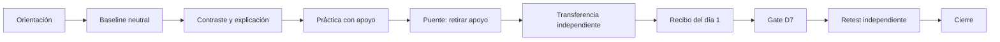

# Propuesta de arquitectura visual: **Trazos de evidencia**

**Estado:** propuesta para revisión del fundador; **sin implementación**  
**Fecha:** 2026-08-09  
**Superficie:** `/crear`  
**Base auditada:** lección `1.17.0`, contenido/audio `2026-08-07-medicion-separada`  

## Decisión ejecutiva

Celestea no necesita más decoración. Necesita que su interfaz haga visible la lógica del aprendizaje.

La propuesta es evolucionar **chalk over film** hacia un sistema denominado **Trazos de evidencia**: el fondo cinematográfico, la tiza, las líneas, la composición y el movimiento cambian de función según la condición pedagógica. Los trazos conectan causa y lenguaje durante la explicación, materializan el apoyo durante la práctica y desaparecen de forma perceptible antes de la transferencia independiente y del retest.

Se preservan:

- todos los tamaños tipográficos actuales;
- Bricolage Grotesque y Plus Jakarta Sans en `/crear`;
- el copy y la secuencia pedagógica de `1.17.0`;
- el video wave, su poster, su fade y sus modos de bajo consumo;
- los contratos de lección, estado, clasificación y telemetría;
- CSS Modules, TypeScript estricto y Framer Motion;
- la posición de las acciones primarias en la zona del pulgar.

No se propone añadir anime.js, GSAP ni otra librería de animación. Framer Motion ya está instalado, ya respeta `prefers-reduced-motion` y cubre las transiciones semánticas requeridas. Una segunda runtime elevaría peso, complejidad y superficie de fallo sin mejorar por sí misma el aprendizaje.

La intervención no convierte cada pantalla en una composición distinta. Define una gramática coherente para seis condiciones principales —**orientación, medición neutral, explicación, práctica apoyada, transferencia independiente y retest**— más dos estados de transición/salida: puente y recibo.

## Fuentes y límites del diagnóstico

### Fuentes revisadas

- Notion [00 · START HERE](https://app.notion.com/p/382c8df743e38171b404e5d187a4e82f), [01 · Qué somos](https://app.notion.com/p/373c8df743e3813f970ef2ffa42c8553), [02 · Decisiones](https://app.notion.com/p/373c8df743e38131ba97d7d7c861013e), [03 · Arquitectura de aprendizaje](https://app.notion.com/p/373c8df743e381aa8d9dd200f5c2b499), [04 · MVP](https://app.notion.com/p/39dc8df743e381bbab1ff0550fa55788), [05 · Telemetría](https://app.notion.com/p/37ac8df743e38198b2c9f34344f38868), [06 · Voz y personalidad](https://app.notion.com/p/388c8df743e381ee96a9d900ee3b7965), [07 · Prompt del arquitecto](https://app.notion.com/p/389c8df743e381eabe5cd5776dd512f2) y [08 · Go-to-market](https://app.notion.com/p/38ec8df743e381068199ce69f04c8532).
- `AGENTS.md`, `docs/CURRENT_STATE.md`, ADR 0001–0007 y código activo de `/crear`.
- Recorrido visual completo de 16 estados a **375 × 812 px** en navegador real, con clasificador local y retest inmediato para auditoría.
- Sistema actual de tokens, CSS Modules, estados del player, comportamiento de audio, responsive, reduced motion y telemetría.
- Auditoría Hallmark previa. Su resultado de cumplimiento es útil, pero no equivale a identidad propia ni a efectividad pedagógica.

### Límites

- Esta es una auditoría experta de interfaz y arquitectura, no evidencia causal de aprendizaje.
- No se observó a un estudiante durante esta revisión. Las hipótesis visuales necesitan prueba de usabilidad y después validación por cohorte.
- Capturas y DOM no sustituyen una prueba completa con lector de pantalla, zoom, teclado, TalkBack ni dispositivos Android de gama baja.
- No pude identificar de manera fiable “IASL” como un sistema de aprendizaje de idiomas. El acrónimo público predominante corresponde a la International Association of School Librarianship; por eso no se usó como fundamento.

## Diagnóstico del flujo actual

La arquitectura pedagógica es más fuerte que la identidad visual. La secuencia separa certeza y producción, conserva la explicación consultable, distingue apoyo de independencia y llega a transferencia + D7. El problema principal es de representación: demasiados estados diferentes se perciben como la misma plantilla —texto blanco, rectángulo oscuro, CTA marfil— y la transición de **“te acompaño”** a **“ahora tú”** se explica principalmente con copy, no con el sistema visual.

| # | Estado observado | Salud | Lectura profesional |
|---:|---|---|---|
| 1 | Llegada | Sólida | Jerarquía clara, artefacto funcional y CTA accesible; la identidad depende casi por completo del fondo. |
| 2 | Baseline de certeza | Sólida | Medición neutral y sin juicio; las tres opciones repiten el mismo lenguaje de rectángulos. |
| 3 | Gate de producción inicial | Mejorable | La divulgación progresiva reduce ansiedad, pero el gran vacío central puede parecer pantalla incompleta. |
| 4 | Contraste A/B | Sólida | Audio y comparación están bien integrados; aquí empieza a aparecer una gramática relacional propia. |
| 5 | Feedback | Sólida | Es específico y cálido; la hoja es visualmente genérica y no debe convertirse en celebración de desempeño. |
| 6 | Explicación | Muy sólida | Es la pantalla con más identidad intrínseca: regla, niveles de certeza y relación forma–evidencia. |
| 7 | Práctica guiada | Sólida | El banco de términos y el movimiento de piezas externalizan estructura; el apoyo podría leerse como un sistema más cohesivo. |
| 8 | Puente a transferencia | Mejorable | El copy prepara bien el cambio de condición; visualmente se siente como otra pantalla del mismo molde. |
| 9 | Caso nuevo con apoyo | Mejorable | La continuidad es correcta, pero no queda suficientemente visible qué apoyo se mantiene y cuál se retirará. |
| 10 | Certeza independiente | Muy sólida | Filas, hairlines y ausencia de tarjetas forman el lenguaje más adecuado para una decisión independiente. |
| 11 | Producción independiente | Sólida | Clara y sin pistas; el textarea se siente más genérico que el resto del instrumento. |
| 12 | Recibo del día 1 | Muy sólida | Separa dos dimensiones sin score, semáforo ni gamificación; funciona como registro, no como premio. |
| 13 | Certeza D7 | Sólida | Mantiene comparabilidad con la transferencia; el tiempo transcurrido sólo vive en el texto. |
| 14 | Producción D7 | Sólida | Conserva independencia y artefacto; cualquier mnemotecnia visual aquí contaminaría la medición. |
| 15 | Cierre final | Sólida | Calmado y comprensible; su amplio vacío es aceptable como cierre, no como patrón de todas las escenas. |
| 16 | Gate D7 | Sólida | Fecha y siguiente acción claras; composición correcta pero poco distintiva. |

**Salud global:** pedagogía y flujo, alta; identidad visual, media; semántica del movimiento, media-baja; accesibilidad estructural observada, alta con verificación pendiente.

## Hallazgos priorizados

### P0 · La identidad no representa la condición pedagógica

**Señal:** baseline, práctica, puente y transferencia comparten una silueta demasiado parecida.  
**Dónde:** recorrido completo, especialmente estados 2, 3, 8, 9, 11 y 14.  
**Riesgo:** el estudiante tiene que leer copy adicional para entender si está observando, practicando con apoyo o demostrando de forma independiente.  
**Corrección:** asignar una gramática visual estable a cada condición, sin añadir texto ni pistas.

### P0 · El retiro del andamiaje ocurre en la lógica, pero no se ve

**Señal:** guía, traducción y banco desaparecen entre etapas, aunque el artefacto y la composición también se reemplazan.  
**Dónde:** práctica guiada → puente → caso apoyado → transferencia independiente.  
**Riesgo:** se pierde una oportunidad metacognitiva: que el alumno perciba “esto que antes estaba disponible ya no está, y el caso permanece”.  
**Corrección:** persistir el artefacto y retirar únicamente el apoyo mediante continuidad espacial y una transición breve, nunca durante una respuesta medida.

### P1 · El movimiento actual es mayormente una entrada universal

**Señal:** cada paso usa el mismo fade + `y` + scale, con una duración normal de aproximadamente 520 ms.  
**Dónde:** `CinematicEnglishPlayer.tsx`.  
**Riesgo:** el movimiento comunica “cambió la pantalla”, pero no qué cambió en el aprendizaje; además puede hacer que una experiencia breve se sienta más lenta.  
**Corrección:** eliminar la entrada universal y usar recetas por evento: conectar, colocar evidencia, retirar apoyo y entregar un caso nuevo.

### P1 · Hay vacío no intencional además de calma intencional

**Señal:** varias escenas concentran información arriba y la acción abajo, dejando una franja central sin función.  
**Dónde:** gates, puente y producción.  
**Riesgo:** en pantallas móviles altas puede leerse como falta de contenido o discontinuidad.  
**Corrección:** usar el espacio para continuidad del artefacto, no para ornamento; conservar aire, pero ajustar ritmo vertical por condición.

### P1 · La instrumentación debe quedar visualmente “ciega” a la respuesta

**Señal:** una nueva identidad podría asociar colores, trazos o posiciones con niveles de certeza durante explicación y luego repetirlos en medición.  
**Dónde:** baseline, transferencia independiente y D7.  
**Riesgo:** una pista visual puede inflar desempeño sin demostrar aprendizaje.  
**Corrección:** prohibir tokens o clases dependientes de la respuesta correcta en estados medidos; misma geometría y tratamiento neutral para todas las opciones.

### P2 · La implementación visual está concentrada

**Señal:** el player supera 2,300 líneas y su módulo CSS supera 2,800.  
**Dónde:** `CinematicEnglishPlayer.tsx` y `CinematicEnglishPlayer.hallmark.module.css`.  
**Riesgo:** un rediseño y un refactor simultáneos ampliarían regresiones justo antes/durante pilotos.  
**Corrección:** añadir una capa semántica tipada mínima ahora; diferir la descomposición estructural a un ADR posterior.

### P0 operativo · La rama local no parte del estado más reciente de `origin/main`

**Señal:** al auditar, `fix/estilo-visual` está limpia, pero `main` local aparece dos commits detrás de `origin/main`.  
**Riesgo:** implementar sobre una base desactualizada puede revivir estados o contradecir el checkpoint de Notion.  
**Corrección:** antes de construir, elegir y sincronizar explícitamente la base de integración; después volver a correr el recorrido visual.

### P1 operativo · El índice público no coincide con la lección activa

**Señal:** `public/workshops/index.json` todavía declara `2026-08-07-proposicion-y-certeza`, mientras la lección y `CURRENT_STATE` declaran `1.17.0` / `2026-08-07-medicion-separada`.  
**Riesgo:** el loader activo de `/crear` abre el JSON directamente y no depende del índice, pero otras superficies o herramientas pueden mostrar metadatos obsoletos.  
**Corrección:** resolverlo fuera de este cambio visual, en el checkpoint previo al siguiente piloto.

### Higiene de datos de esta auditoría

El recorrido completo ejecutó el runtime real y produjo dos sesiones anónimas en `eventos_de_aprendizaje`; no contienen alias ni `class_token`. No se borró ningún registro:

- `8afdeaeb-d16e-43f6-b6d5-2bd5747baf3a`: 31 eventos, 22:39:47–22:46:19 UTC;
- `fa62d068-0679-47a7-9dda-e559e5b4f113`: 26 eventos, 22:49:27–22:50:02 UTC.

Ambas deben excluirse del análisis de piloto o eliminarse con aprobación explícita. La siguiente automatización visual debe iniciar el servidor con ingestión deshabilitada o con una variante de auditoría identificable.

## Sistema visual propuesto

### Nombre y principio

**Trazos de evidencia** no es un tema nuevo encima de Celestea. Es una regla:

> Cada marca visual debe mostrar una relación, una ayuda disponible, una decisión tomada o la continuidad de la evidencia. Si sólo adorna, se elimina.

La tiza no se usa como textura nostálgica. Se usa como modelo mental: subrayar una pista, conectar evidencia con grado de certeza, ocupar un hueco en una estructura y después borrar el soporte sin borrar el trabajo del alumno.

### Gramática por condición

| Condición | Composición | Superficie | Movimiento permitido | Prohibido |
|---|---|---|---|---|
| Orientación | Artefacto protagonista y una sola acción | Fondo atmosférico, casi sin contenedor | Aparición calmada del artefacto/voz | Carruseles, partículas, promesas ornamentales |
| Medición neutral | Filas o campos planos, opciones equivalentes | Hairlines y contraste, no tarjetas expresivas | Respuesta local a selección | Pistas por color, forma, posición o timing |
| Explicación | Regla y relaciones en el centro | Rail consultable y trazos de relación | `trace-connect` para dirigir atención | Animar cada palabra o revelar información demasiado rápido |
| Práctica apoyada | Artefacto + apoyo claramente agrupado | El apoyo tiene borde/rail propio | `term-travel`, colocación y feedback local | Confeti, rebote, shake punitivo |
| Transferencia independiente | Mismo artefacto; apoyo ausente | Superficie más plana y silenciosa | `scaffold-withdraw` antes de iniciar la medición | Cualquier recordatorio de la regla objetivo |
| D7 | Misma gramática independiente | Atmósfera más quieta, sin mnemotecnia | Crossfade breve; poster estático si aplica | Reintroducir guía, colores de certeza o “racha” |
| Recibo/cierre | Registro tipográfico de dimensiones | Líneas y peso, no score-card | `evidence-settle` después de responder | Medallas, contador, fuegos artificiales |

### Color, superficie y espacio

- Mantener la paleta profunda, marfil, neutrales y estados existentes.
- La wave cambia de presencia mediante opacidad/máscara por **fase pedagógica**, no mediante nuevos colores por pantalla.
- Reservar el verde para confirmación/estado ya resuelto, nunca como pista previa.
- Reducir rectángulos oscuros redondeados. Una superficie existe sólo cuando agrupa elementos que deben entenderse juntos.
- Usar hairlines para elecciones independientes, rail para explicación/apoyo y sheet sólo para interrupciones modales.
- Mantener el CTA principal marfil y su posición móvil; no añadir un segundo color de marca para “dar vida”.
- Reequilibrar el vacío con continuidad del artefacto o mejor distribución vertical; no llenarlo con blobs, labels o ilustraciones decorativas.

### Tipografía: restricción bloqueada

No se cambiará ningún valor de `--celestea-text-xs` a `--celestea-text-display`, ni su asignación actual sin una aprobación distinta. La jerarquía se mejora con:

- ancho de lectura;
- peso;
- alineación;
- proximidad;
- contraste;
- ritmo vertical.

El archivo encontrado es `src/styles/typography.ts`, no `typography.md`. Contiene utilidades Tailwind de superficies antiguas y **no debe convertirse en dependencia de `/crear`**. La fuente tipográfica activa de `/crear` son los tokens raíz y el CSS Module del player.

### Movimiento semántico

| Receta | Qué explica | Duración objetivo | Reduced motion |
|---|---|---:|---|
| `selection-ack` | “Registré tu decisión” | 80–100 ms | Cambio instantáneo de contraste/foco |
| `trace-connect` | “Esta evidencia modifica esta forma” | 180–240 ms | Trazado ya presente o fade ≤120 ms |
| `term-travel` | “Esta pieza ocupa este papel sintáctico” | 220–320 ms | Reemplazo sin trayecto |
| `scaffold-withdraw` | “El caso sigue; la ayuda se retira” | 280–360 ms | Desaparición por opacidad ≤120 ms |
| `case-handoff` | “Es un caso nuevo bajo la misma tarea” | 320–420 ms | Crossfade ≤120 ms |
| `evidence-settle` | “Esta dimensión quedó registrada” | 140–180 ms | Estado final inmediato |

Reglas:

- máximo dos transiciones semánticas por pantalla;
- sólo `transform` y `opacity` en el camino frecuente;
- ninguna animación bloquea input ni navegación;
- ninguna entrada universal, scroll reveal, parallax, bounce, confetti o animación infinita de interfaz;
- las transiciones deben poder interrumpirse;
- `MotionConfig reducedMotion="user"` y `useReducedMotion` continúan siendo obligatorios;
- la wave permanece pausada en reduced motion, modo ligero y pestaña oculta, conservando poster/fallback.

## Propuesta de arquitectura — 10 entregables

### 1. Decisión propuesta

Añadir una capa visual semántica y tipada encima del runtime actual. El estado pedagógico existente se mapea a un `LearningVisualMode`; ese modo controla composición, superficie, ambiente y una receta limitada de movimiento. No se introduce un renderer alterno ni se modifica la secuencia de la lección.

```ts
export type LearningVisualMode =
  | 'orient'
  | 'measure'
  | 'explain'
  | 'supported'
  | 'bridge'
  | 'independent'
  | 'retest'
  | 'receipt';

export type SceneMotionName =
  | 'none'
  | 'selection-ack'
  | 'trace-connect'
  | 'term-travel'
  | 'scaffold-withdraw'
  | 'case-handoff'
  | 'evidence-settle';

export interface SceneMotionRecipe {
  name: SceneMotionName;
  durationMs: number;
  reducedDurationMs: number;
  preservesArtifact: boolean;
}
```

El mapping será una función pura, exhaustiva y testeada. El DOM recibirá `data-learning-mode`; CSS Modules resolverá la apariencia. Framer Motion sólo resolverá eventos cuya relación temporal no puede expresarse con un estado estático.

### 2. Evidencia que lo justifica

- En 16 estados, las diferencias pedagógicas son mayores que las diferencias visuales.
- Explicación y certeza independiente ya contienen los dos lenguajes más prometedores: rail relacional y filas planas.
- La transición práctica → independencia es pedagógicamente central, pero visualmente débil.
- El audit Hallmark existente confirma que la interfaz evita muchos clichés. La deuda restante no es “AI slop”; es **uniformidad sin semántica suficiente**.
- La evidencia de aprendizaje respalda práctica de recuperación, transferencia y retest, no estimulación ornamental. El testing repetido mejora retención y transferencia en condiciones estudiadas ([Butler, 2010](https://pubmed.ncbi.nlm.nih.gov/20804289/); [Roediger & Karpicke, 2006](https://doi.org/10.1111/j.1467-9280.2006.01693.x)).
- Señalización y coherencia ayudan cuando dirigen la atención a relaciones relevantes; añadir material interesante pero irrelevante eleva procesamiento extrínseco ([Cambridge Handbook of Multimedia Learning](https://www.cambridge.org/core/books/abs/cambridge-handbook-of-multimedia-learning/principles-for-reducing-extraneous-processing-in-multimedia-learning/F29A19FCD34C542806F736E0661C05F5)).
- La animación no es universalmente mejor: el carácter transitorio puede perjudicar; el cueing puede redirigir la mirada sin garantizar transferencia ([Lowe & Boucheix](https://eric.ed.gov/?id=EJ978021); [de Koning et al.](https://www.sciencedirect.com/science/article/pii/S0747563210001470)). Por eso se anima la relación, no la decoración.
- No se diseñará para “tipos de aprendizaje”. La evidencia no respalda emparejar instrucción con supuestos estilos individuales ([Pashler et al.](https://doi.org/10.1111/j.1539-6053.2009.01038.x)). Sí se diseñará para variabilidad: voz + fallback visible, controles claros y reducción de carga irrelevante.

### 3. Flujo de estado



El único momento donde el sistema muestra explícitamente la retirada del apoyo es `D → E`. Al entrar a `F`, la transición terminó y la interacción ya está disponible. Baseline, transferencia y D7 no heredan trazos que codifiquen la respuesta.

### 4. Contratos TypeScript y JSON

**Sin cambios:**

- JSON de lección y validación;
- claves de rama del clasificador;
- `studyState` y persistencia local;
- contratos de audio;
- `LearningEvent`, verbos y esquema de ingestión.

**Nuevo contrato interno:** `LearningVisualMode`, `SceneMotionName` y `SceneMotionRecipe`. No se serializa, no llega a Supabase y no permite contenido generado.

**Guardrail de medición:** una prueba recorre todos los estados `measure`, `independent` y `retest` y falla si el DOM contiene variantes visuales dependientes de la rama correcta antes de enviar respuesta.

### 5. Árbol de componentes y archivos

```text
tokens.css                                               modificar aliases visuales/motion; tamaños bloqueados
src/components/crear/v2/
├── CinematicEnglishPlayer.tsx                           modificar mapping + data-learning-mode
├── CinematicEnglishPlayer.hallmark.module.css           modificar gramática por condición
└── sceneMotion.ts                                       crear contratos y recetas tipadas
docs/design/Celestea-visual-system.md                    crear después de validar la implementación
```

No se propone dividir todavía el player ni su CSS. Primero se aísla el cambio visual y se reduce el radio de regresión. Una descomposición futura merece un ADR independiente.

### 6. Datos, privacidad y telemetría

- Cero datos nuevos para el MVP visual.
- No se registran movimientos, hover, atención inferida ni señales de vigilancia.
- Se mantiene `trackEvent(verbo, { tallerId, pasoId, result })`.
- El éxito sigue siendo transferencia independiente + D7, con asistencia distinguible; no tiempo en pantalla ni cantidad de animaciones vistas.
- No mezclar resultados de dos variantes visuales bajo el mismo artefacto piloto. Para el piloto pequeño, el Git SHA congelado identifica la variante. Si más adelante se hace A/B concurrente, `uiVariant` podría viajar dentro de `result`, nunca en una columna o verbo nuevo, y requeriría aprobación específica.

### 7. Offline, accesibilidad y rendimiento

- Cero dependencia nueva y cero request de red para movimiento.
- Animaciones sólo sobre `transform`/`opacity`; medir long tasks y bundle antes/después.
- Con `prefers-reduced-motion`, sustituir viajes por estado final/crossfade. Motion recomienda preservar contexto con opacidad y evitar grandes transforms o autoplay ([Motion accessibility](https://motion.dev/docs/react-accessibility)).
- Con `saveData`, hardware limitado o video no disponible, conservar poster y atmósfera estática.
- Mantener targets táctiles, safe areas y foco visible. WCAG 2.2 incorpora `Target Size (Minimum)` como criterio AA ([W3C WAI](https://www.w3.org/WAI/standards-guidelines/wcag/new-in-22/)).
- Narración siempre con texto visible/fallback y sin depender de color o movimiento.
- Probar 320 px de ancho, landscape y 125% de tamaño raíz sin cambiar los tokens tipográficos.
- Mantener `preload="metadata"` para audio y evitar precarga agresiva del video; la guía oficial de Next recomienda controlar la carga de video para no afectar rendimiento ([Next.js video guide](https://nextjs.org/docs/app/guides/videos)).

### 8. Migración y compatibilidad

1. Sincronizar la rama experimental con la base aprobada.
2. Congelar capturas de `1.17.0` como baseline visual.
3. Introducir sólo `sceneMotion.ts` y `data-learning-mode`; comportamiento visual inicial idéntico.
4. Migrar una condición a la vez: medición → explicación → apoyo → puente → independencia → D7/recibo.
5. Validar cada condición antes de continuar.
6. No tocar JSON, copy, audio ni clasificación.
7. No introducir el rediseño en una cohorte ya iniciada. La siguiente cohorte recibe un SHA congelado.

Los browsers sin soporte de animación conservan la composición final. El sistema se degrada a estado estático, no a una UI incompleta.

### 9. Riesgos y alternativas

| Riesgo | Mitigación |
|---|---|
| El diseño insinúa la respuesta | Neutralidad automatizada en baseline/transfer/D7; revisión pedagógica antes de merge. |
| La animación aumenta latencia percibida | Interacción inmediata; límites de duración; no esperar a `onAnimationComplete`. |
| La identidad se vuelve decorativa | Regla “relación, apoyo, decisión o evidencia”; eliminar cualquier marca sin función. |
| Cambiar UI invalida comparaciones de piloto | No mezclar cohortes/SHA; documentar variante en 02 y CURRENT_STATE. |
| El monolito dificulta cambios | Capa mínima, sin refactor simultáneo; tests visuales por condición. |
| La wave pesa en Android limitado | Mantener poster/fade y modo ligero; verificar `saveData` y reduced motion. |

Alternativas descartadas:

- **Anime.js/GSAP además de Framer Motion:** mayor peso y dos modelos de lifecycle.
- **Bento, glassmorphism, blobs, gradientes de acento o dashboard cards:** lenguaje genérico y contrario a la tarea única.
- **Gamificación:** optimiza retorno/actividad, no evidencia de transferencia durable.
- **Tema distinto por pantalla:** aumenta cambio de contexto y rompe comparabilidad.
- **Sólo cambiar colores:** no resuelve la falta de semántica entre condiciones.
- **Refactor total del player junto con el rediseño:** mezcla riesgos y dificulta rollback.

### 10. Verificación y rollback

**Matriz visual mínima**

- 16 estados auditados a 375 × 812.
- 320 × 812, 414 × 896, tablet 768 px y 812 × 375.
- Teclado, foco, 125% root text, light/dark OS si aplica, reduced motion y `saveData`.
- Audio listo, audio fallido, offline, clasificador local y retorno D7.

**Checks técnicos**

- typecheck, lint del contenido, tests del runtime y E2E existentes;
- test exhaustivo del mapping `stage → LearningVisualMode`;
- test de ausencia de apoyo en estados independientes;
- test de neutralidad visual antes de respuesta;
- comparación de bundle y long tasks en emulación Android limitada;
- comparación visual lado a lado con el baseline, no revisión de capturas aisladas.

**Validación con personas**

- Primero: 5–8 sesiones de usabilidad del flujo visual, observando si el alumno reconoce cuándo tiene apoyo y cuándo trabaja solo.
- Después: cohorte nueva y congelada. Métrica primaria: transferencia independiente + D7. Guardrails: finalización, abandono, solicitud de guía, fallo de audio y latencia por paso.
- No declarar victoria por preferencia estética ni tiempo de uso. La pregunta causal es si la nueva gramática reduce fricción sin elevar artificialmente el desempeño medido.

**Rollback**

- Revertir aliases visuales, `data-learning-mode` y `sceneMotion.ts` sin migrar datos.
- Mantener sin cambios JSON, estado local y telemetría.
- Conservar el SHA anterior como baseline reproducible.

## Criterio crítico sobre los sistemas consultados

Hallmark ayudó a preservar restricción y detectar anti-patrones, pero su auditoría de cumplimiento no detectó que una interfaz puede evitar clichés y aun sentirse uniforme. UI/UX Pro Max sugirió patrones como bento, glassmorphism, acentos rojos, Inter y presets GSAP; se descartaron porque responden a un catálogo genérico, no al instrumento pedagógico ni a la identidad existente. Se conservaron sólo sus recordatorios universales sobre target táctil, continuidad, reduced motion y rendimiento.

La conclusión no es “más microanimación”. Es **menos movimiento, con más significado**.

## Puerta de aprobación

Esta propuesta no autoriza implementación. Para construirla se necesita aprobación explícita del fundador sobre:

1. la dirección **Trazos de evidencia**;
2. Framer Motion como única runtime;
3. la regla de neutralidad visual en baseline/transfer/D7;
4. el alcance mínimo de archivos;
5. la base Git desde la que debe continuar la rama experimental.
